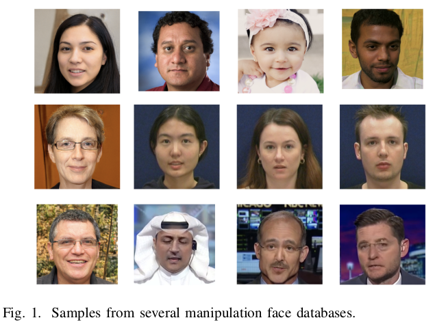
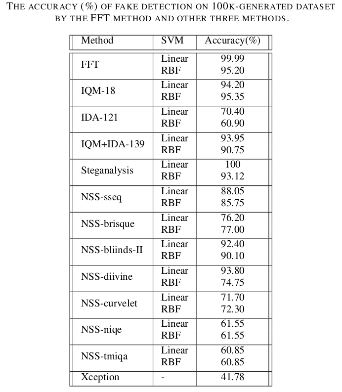
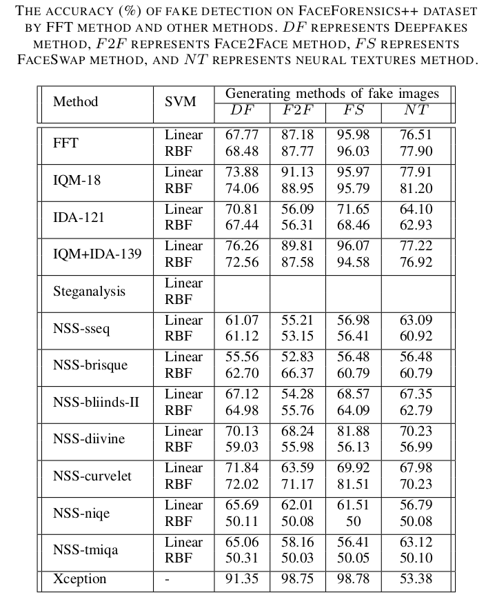
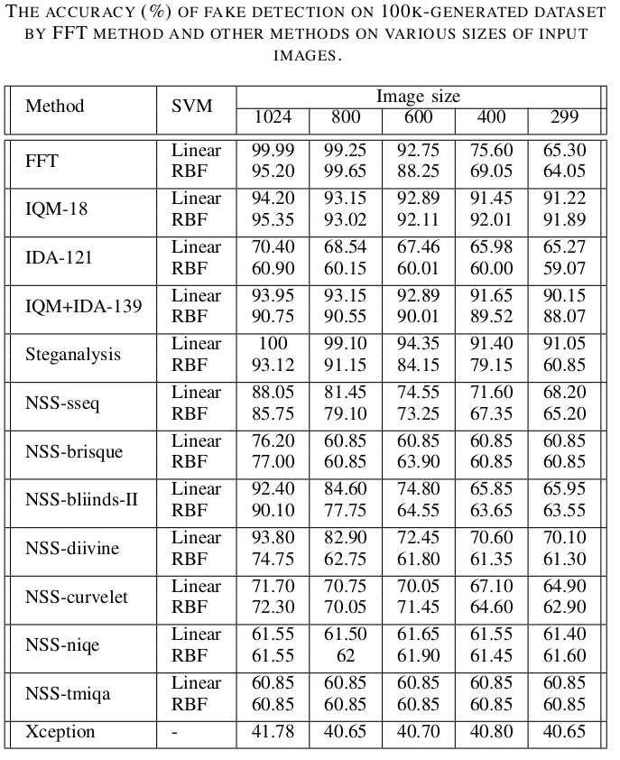
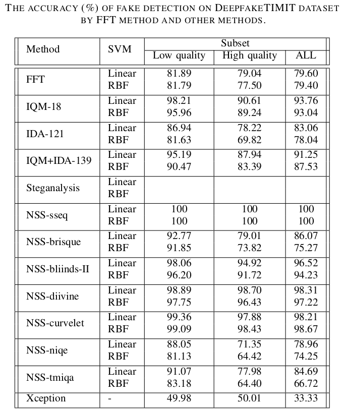

# Deepfake face image detection
This repository explores some detection algorithms for deepfake face images detection, and tries to extract more representative features of fake face images.

# Content
* codes of deepfake detection algorithms

# Introduction
* Cast the forgery detection as a binary classification problem (real/fake).

# Manipulated face databases
* 100k-generated dataset from Flickr-Face-HQ Dataset
* FaceForensics++ database by four manipulation methods
* DeepfakeTIMIT generated from VidTIMIT

  
  
# Image features
## Fast Fourier Transform (FFT) based Feature
  * Analyzes the characteristics of images on a domain defined by the Fourier transform.
  * Given an image applied with the Fourier transform, the Fourier coefficients indicate the energy distribution of the image over a range of
frequencies.

## Image Quality Measure (IQM)
  * Image quality analysis perform outstandingly in image manipulation detection of the forensic field.
  * Image quality assessment has been adopted in face anti-spoofing method and gained a pretty good performance, which indicated that the analysis of the general image quality on real face images reveals highly valuable information that may be very efficiently used to discriminate them from fake images.
  * The goal of the image quality measure is to provide a quantitative score that describes the degree of fidelity or, conversely, the level of distortion of a given test image according to an original distortion-free image.
  * Expected quality differences between real and fake samples may include: degree of sharpness, color and luminance levels, local artifacts, amount  of information found in both type of images (entropy), structural distortions or natural appearance.
 
  (1) IQM-18: A total of 18 general image quality features.
 
   MSE (Mean Squared Error), PSNR (Peak Signal to Noise Ratio), SNR (Signal to Noise Ratio), SC (Structual Content), MD (Maximum Difference), AD (Average Difference), NAE (Normalized Absolute Error), RAMD (R-Averaged MD), LMSE (Laplacian MSE), NXC (Normalized Cross-Correlation), MAS (Mean Angle Similarity), MAMS (Mean Angle Magnitude Similarity), SME (Spectral Magnitude Error), GME (Gradient Magnitude Error), GPE (Gradient Phase Error), SSIM (Structural Similarity Index), VIF (Visual Information Fidelity), and HLFI (High-Low Frequently Index). 

(2) IQM-121:

    It is another discriminative feature that can be capable of differentiating between genuine and fake faces based on a single frame.
    Four different features, i.e., specular reflection, blurriness, chromatic moment, and color diversity, are extracted in our work, constituting a 121-dimensional feature vector. 

## Steganalysis Feature
* The main idea is that a rich model should consist of a large number of diverse submodels.
* It assembled a rich model of the noise component as a union of many diverse submodels.
* These submodels are formed by joint distributions of neighboring samples from quantized image noise residuals obtained using linear and nonlinear high-pass filters, which consider various types of relationships among neighboring samples of noise residuals obtained by linear and nonlinear filters with compact supports.
* The final rich model contains 106 submodels and the feature gets a total of 34,671 dimension.

## Natural Scene Statistics based Features

* Natural image mean the real image captured by regular cameras.
* The natural undistorted image shows certain statistical properties.
* The presence of distortions in natural images alters the natural statistical properties of images, thereby rendering them and their statistics unnatural.
* Natural scene statistics (NSS) models seek to capture these statistical properties of natural scenes that hold across different contents.
* In this work, we selected seven types of NSS feature from well known no-reference image quality assessment (NR-IQA) algorithms:

  (1) Spatial and spectral entropy feature,

  (2) BRISQUE feature,

  (3) BLIINDS-II feature,

  (4) DIIVINE feature,

  (5) Curvelet feature,

  (6) NIQE feature and

  (7) TMIQA features.

## Learning-based Features
* Xception is a CNN based deep network trained on ImageNet.
* FaceForensics++ transfer it to the forgery detection task by replacing the final fully connected layer with two outputs.
* We use the well-trained network for our classification.

# Analysis and comparison
* we extracted four types of image features, including Fast Fourier Transform (FFT), Image Quality Measure (IQM), Image Distortion Analysis (IDA), and deep learning based feature, on three manipulation face datasets, for binary classification (real or fake) using Support Vector
Machine (SVM) with linear and RBF kernal.

